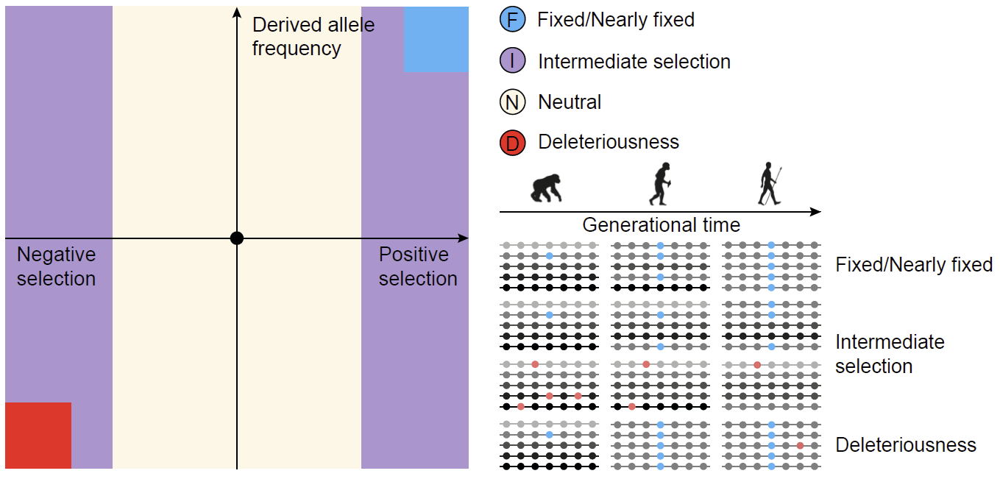

# FIND

Despite advances in annotating and interpreting human genetic variants, existing methods to distinguish pathogenic from neutral variants still inadequately capture the nuanced impact of genetic variants on fitness and disease susceptibility. To address this, we introduced FIND, a method that enhances resolution in differentiating trait-modulating alleles from pathogenic or neutral ones by stratifying genetic variants into refined categories based on selection pressures and derived allele frequency (DAF) . We have expanded the conventional binary partitioning of all human genome variants into four nuanced categories, utilizing the dimensions of natural selection and derived allele frequency spectrum (as shown below), including: 1) Fixed/Nearly Fixed (**F**) category; 2) Intermediate Selection (**I**) category; 3) Neutral (**N**) category; 4) Deleteriousness (**D**) category.



- FIND improved resolution for identifying favored allele with trait-modulating effect.

- We welcome any discussion, suggestion and potential contribution of new functional prediction scores through github or contact Dr. Mulin Jun Li (mulinli{at}connect.hku.hk).

  

## Download

### FIND V1.0

- **Genome build GRCh37 / hg19**

  All possible SNVs of GRCh37 / hg19 [Download](http://mulinlab.l2.ttut.cc/FINDer/Data_Score/hg19/) (494G)

  All possible SNVs of GRCh37 / hg19 incl. all annotations [Download](http://mulinlab.l2.ttut.cc/FINDer/Data_Anno/hg19/) (1.3T)

- **Genome build GRCh38 / hg38**

  All possible SNVs of GRCh38 / hg38 [Download](http://mulinlab.l2.ttut.cc/FINDer/Data_Score/hg38/) (492G)

  All possible SNVs of GRCh38 / hg38 incl. all annotations [Download](http://mulinlab.l2.ttut.cc/FINDer/Data_Anno/hg38/) (1.3T)


## Usage

### Score interpretation and prioritization

We have expanded the conventional binary partitioning of all human genome variants into four nuanced categories, utilizing the dimensions of natural selection and derived allele frequency (DAF) spectrum. Therefore, for each SNV, FIND will provide the probability that the variant is predicted to be in four categories, named: FIND_F, FIND_I, FIND_N, FIND_D. The raw scores reported by FIND can be used to determining the categories of variant. Similar to CADD C-scores and it's phred-like scores (**PHRED score**), we recommend to use phred-like scores (FIND_F_PHRED, FIND_I_PHRED, FIND_N_PHRED, FIND_D_PHRED) for the likely causal variant prioritization (for each FIND categories).

### Get the FIND scores

- Get all pre-calculated FIND scores in [hg19](http://mulinlab.l2.ttut.cc/FINDer/Data_Score/hg19/) (494G)/[hg38 ](http://mulinlab.l2.ttut.cc/FINDer/Data_Score/hg38/)(492G). 

  > Suitable for annotation of a large number of variants.

  - Download the FIND score file and the relevant vanno file.

    ```bash
    # hg19
    wget -c http://mulinlab.l2.ttut.cc/FINDer/Data_Score/hg19/FIND_variants_ALL.hg19.scores.tsv.gz
    wget -c http://mulinlab.l2.ttut.cc/FINDer/Data_Score/hg19/FIND_variants_ALL.hg19.scores.tsv.gz.vanno
    wget -c http://mulinlab.l2.ttut.cc/FINDer/Data_Score/hg19/FIND_variants_ALL.hg19.scores.tsv.gz.vanno.vi
    
    # hg38
    wget -c http://mulinlab.l2.ttut.cc/FINDer/Data_Score/hg38/FIND_variants_ALL.hg38.scores.tsv.gz
    wget -c http://mulinlab.l2.ttut.cc/FINDer/Data_Score/hg38/FIND_variants_ALL.hg38.scores.tsv.gz.vanno
    wget -c http://mulinlab.l2.ttut.cc/FINDer/Data_Score/hg38/FIND_variants_ALL.hg38.scores.tsv.gz.vanno.vi
    ```

  - Get the FIND prediction scores by using [VarNote](http://www.mulinlab.org/varnote/index.html).

    ```bash
    # Modify configuration files (FIND_ScoreAnno_SNV.config)
    ## 1.Path of FIND score file
    ## 2.Path and format of query file
    ## 3.Path of output file
    
    # Get score
    java -jar /path to/VarNote-1.2.0.jar AnnotationConfig -I ./config/FIND_ScoreAnno_SNV.config
    ```

  Please refer to this [document](http://www.mulinlab.org/varnote/documentaiton.html) for more details on downloading and using VarNote.

- Query the pre-calculated FIND scores of the interested variants directly.

  > Suitable for quick consultation of a small number of interested variants.

  - Access the [VannoPortal](http://www.mulinlab.org/vportal/index.html) website for variant score.

  - Access remote database with VarNote. 
    The header information of FIND score file can be found [here](./config/FINDScore.header) (or for more [details](./Reference_information/FIND_score_information.xlsx)).
    ```bash
    java -jar VarNote.jar RandomAccess \
    -Q 1:959100-959200 \
    -D:db,tag=Scores \
    http://mulinlab.l2.ttut.cc/FINDer/Data_Anno/hg38/FIND_variant_ALL.hg19.Scores.tsv.gz
    ```

- Recalculated FIND raw scores by the trained FIND model.

  Please refer to the following method for [feature annotation](#Procedures).

  ```bash
  cd ./script/02_ModelTraining
  python ./script/FIND_predict.py -i [input file] -o [output file]
  ```

## Building FIND model

### Requirements

- python 3.10
- [TabNet](https://github.com/dreamquark-ai/tabnet)
- [scikit-learn](https://scikit-learn.org/stable/)
- [VarNote](http://www.mulinlab.org/varnote/index.html)

### Procedures

1. Obtain FIND training data.

   The FIND is based on the differences in fitness among genetic variants from different evolutionary processes in modern human genome. Specifically, FIND distinguishes between genetic variants that derived allele have undergone fixed/nearly fiexed (labelled **F**), intermediate selection (labelled **I**), neutral (labelled **N**), and deleterious/*de novo* (labelled **D**). We constructed a training dataset comprising approximately 2 million variants, ensuring a balanced representation across four distinct categories.

   > The FIND training data set is [FIND_Training_Data.tsv](./train_dataset), and the corresponding relationship of data labels is F:0, I:1, N:2, D:3.

2. Feature annotation and processing.

   To more comprehensively capture the evolutionary patterns and adaptive selection mechanisms of human variations, especially those located in non-coding regions, we systematically computed and integrated 289 base-wise variant annotation features across the whole genome, with a significant percentage achieving allele-specific resolution.

   - Download annotation file in [hg19](http://mulinlab.l2.ttut.cc/FINDer/Data_Anno/hg19/) (1.2T)/[hg38](http://mulinlab.l2.ttut.cc/FINDer/Data_Anno/hg38/) (1.2T).

     ```bash
     # hg19
     wget -c http://mulinlab.l2.ttut.cc/FINDer/Data_Anno/hg19/FIND_variant_ALL.hg19.Annotation.tsv.gz
     wget -c http://mulinlab.l2.ttut.cc/FINDer/Data_Anno/hg19/FIND_variant_ALL.hg19.Annotation.tsv.gz.vanno
     wget -c http://mulinlab.l2.ttut.cc/FINDer/Data_Anno/hg19/FIND_variant_ALL.hg19.Annotation.tsv.gz.vanno.vi
     
     # hg38
     wget -c http://mulinlab.l2.ttut.cc/FINDer/Data_Anno/hg38/FIND_variant_ALL.hg38.Annotation.tsv.gz
     wget -c http://mulinlab.l2.ttut.cc/FINDer/Data_Anno/hg38/FIND_variant_ALL.hg38.Annotation.tsv.gz.vanno
     wget -c http://mulinlab.l2.ttut.cc/FINDer/Data_Anno/hg38/FIND_variant_ALL.hg38.Annotation.tsv.gz.vanno.vi
     ```

   - Annotated training dataset by using VarNote or other way.

     ```bash
     # Examples of VarNote annotations
     # Modify configuration files (BigAnno_SNV.config)
     ## 1.Path of feature file
     ## 2.Path and format of query file
     ## 3.Path of output file
     
     java -jar /path to/VarNote-1.2.0.jar AnnotationConfig -I ./config/BigAnno_SNV.config
     ```

   - Query the interested variant annotations by accessing the remote database.
    The header information of FIND annotation file can be found [here](./config/BigAnno.header) (or for more [details](./Reference_information/Feature_information.xlsx)).
     ```
     java -jar VarNote.jar RandomAccess \
     -Q 1:959100-959200 \
     -D:db,tag=Scores \
     http://mulinlab.l2.ttut.cc/FINDer/Data_Anno/hg19/FIND_variant_ALL.hg19.Annotation.tsv.gz
     ```

   - Feature processing.

     ```bash
     cd ./script/01_DataAnno
     python ./Variants_Annotation_process.py -i [input file] -o [output file]
     ```

3. Model training.

   We utilized the [TabNet](https://github.com/dreamquark-ai/tabnet) model to classify four genetic variant categories in our training set.

   ```bash
   cd ./script/02_ModelTraining
   python FIND_TabNet_train.py --ModelP [path to training dataset] --MoldeF [training dataset file name] --ModelO [path to output model file]
   ```

## Copyright

Copyright (c) Mulinlab@Tianjin Medical University 2020-2024. All rights reserved.
